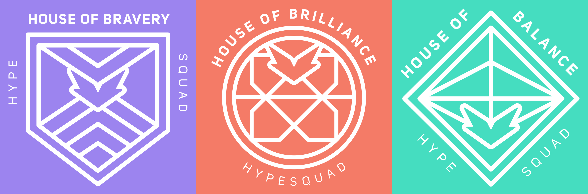

## Get HypeSquad Badges (really, not client-sided)

## Paste the code to `Console` in Discord
> For browser press `F12`  -  For desktop client press `Ctrl + Shift + I`
```js
let wreq = webpackChunkdiscord_app.push([[Symbol()],{},r=>r]);
webpackChunkdiscord_app.pop();
const chunks = Object.entries(wreq.m)
const findChunkByCode = (...codes) => {
    for (let i = 0; i < chunks.length; i++) {
        const [id,func] = chunks[i]
        const chunkCode = func.toString()

        if (codes.every(code=>chunkCode.includes(code))) return wreq(id)
    }
}

const api = Object.values(findChunkByCode("HTTPUtils")).find(e=>e?.get)

api.post({url: "/hypesquad/online",body:{house_id: 1}})
```
<details>
  <summary>What you should do if you can't paste the code? (Click here to view)</summary>

### Type these 3 separately in the `Console`, it will allow you to paste the code into the console  

```
"allow pasting"
```
```
'allow pasting'
```
```
allow pasting
```
</details>
<details>
  <summary>How to remove the Badge? (Click here to view)</summary>

### Paste this code into `Console` then your Badge gonna be removed

```js
let wreq = webpackChunkdiscord_app.push([[Symbol()],{},r=>r]);
webpackChunkdiscord_app.pop();
const chunks = Object.entries(wreq.m)
const findChunkByCode = (...codes) => {
    for (let i = 0; i < chunks.length; i++) {
        const [id,func] = chunks[i]
        const chunkCode = func.toString()

        if (codes.every(code=>chunkCode.includes(code))) return wreq(id)
    }
}

const api = Object.values(findChunkByCode("HTTPUtils")).find(e=>e?.get)

api.del({url: "/hypesquad/online"})
```
</details>

# You must change last part [{house_id: ...}](https://github.com/k4g9/Get-HypeSquad-Badges/blob/main/code.js) for different hypesquad badges
| Value | HypeSquad Hose | Badge |
|:------:|:---------:|:-------:|
| 1 | Bravery |  |
| 2 | Brilliance |  |
| 3 | Balance |  |
---

